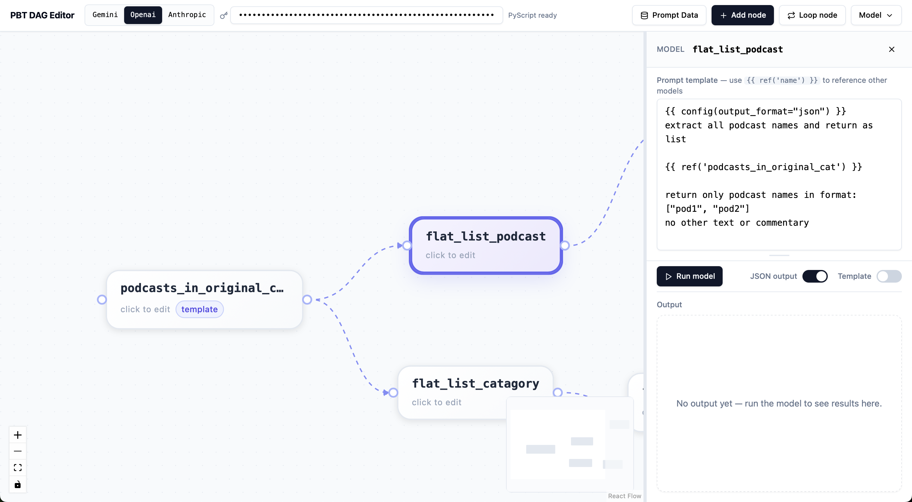
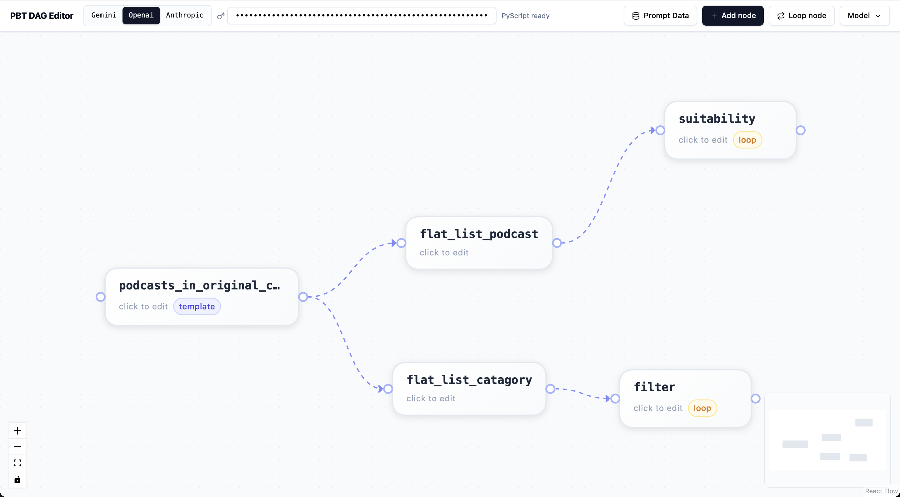

# prompt-build-tool DnD

Drag-and-drop DAG editor for [pbt](https://github.com/conradbez/prompt-build-tool).

Helps build LLM prmompts systematically. One prompts outputs can dynamically be fed to the next prompt using drag-and-drop.

Example: https://conradbez.com/prompt-build-tool-dnd/dist/






## Start

**Backend** (from `dnd_server/`):
```bash
cd dnd_server
GEMINI_API_KEY=your_key uvicorn main:app --port 8000 --reload
```

Use the env var matching your provider:

| Provider  | Env var             |
|-----------|---------------------|
| Gemini    | `GEMINI_API_KEY`    |
| OpenAI    | `OPENAI_API_KEY`    |
| Anthropic | `ANTHROPIC_API_KEY` |

The server uses the env var automatically — no need to enter the key in the UI. You can still override it per-run by entering a key in the UI.

**Frontend** (from repo root):
```bash
yarn dev
```

Open [http://localhost:5173](http://localhost:5173).

## Compile (static / no server)

```bash
yarn build
```

Outputs to `dist/` — open `dist/index.html` directly in a browser or deploy to any static host (GitHub Pages, S3, Netlify). No backend needed when `USE_SERVER=false` (PyScript mode).

Use `yarn build` instead of `yarn dev` when you want to share or deploy the tool without running a Node dev server.

## Features

- **Loop over JSON responses** — iterate over JSON array outputs and run each item as its own prompt using `loop_model`, enabling batch processing pipelines
- **Dependency analysis & parallel execution** — automatically analyses dependencies between prompts in the DAG and runs independent prompts in parallel for faster execution
- **Export to Python file** — export your entire prompt graph to a single self-contained Python script that can be run on a server without the UI
- **Central data & file management** — shared "data" and "file" stores across the graph so prompts can read and write common state without wiring every connection manually

## Modes

Set `USE_SERVER` in `src/api.ts`:

- `false` — PyScript mode (runs in browser, no backend needed, no file support)
- `true` — Server mode (requires backend, enables prompt file uploads)
