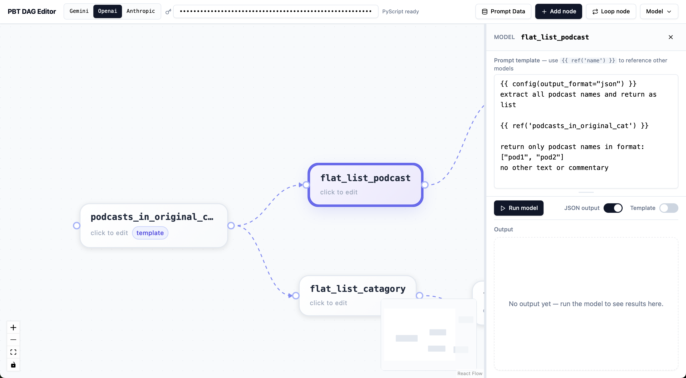
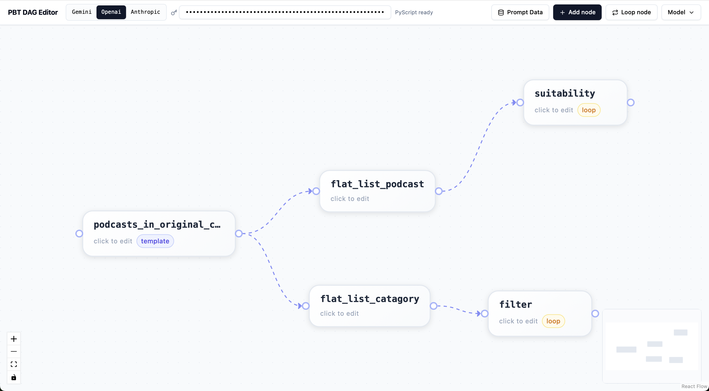

# prompt-build-tool DnD

Drag-and-drop DAG editor for [pbt](https://github.com/conradbez/prompt-build-tool).

Helps build LLM prmompts systematically. One prompts outputs can dynamically be fed to the next prompt using drag-and-drop.

Example: https://conradbez.com/prompt-build-tool-dnd/dist/






## Start

**Backend** (from `dnd_server/`):
```bash
cd dnd_server
GEMINI_API_KEY=your_key uvicorn main:app --port 8000 --reload
```

Use the env var matching your provider:

| Provider  | Env var             |
|-----------|---------------------|
| Gemini    | `GEMINI_API_KEY`    |
| OpenAI    | `OPENAI_API_KEY`    |
| Anthropic | `ANTHROPIC_API_KEY` |
| Local     | _none_              |


The server uses the env var automatically — no need to enter the key in the UI. You can still override it per-run by entering a key in the UI.

## Local models (no key, no server)

Pick one of the **`local (…)`** entries in the provider dropdown to run a model
entirely in the browser via [WebLLM](https://github.com/mlc-ai/web-llm) — no API
key and no network round trip once the weights are cached. Local always runs
in-browser, even in server mode.

Three size tiers are available:

| Tier               | Model                              | Download | GPU memory | Notes |
|--------------------|------------------------------------|----------|------------|-------|
| `local (small)`    | `SmolLM2-360M-Instruct-q4f16_1`    | ~195 MB  | ~0.4 GB    | Loads in well under a minute. Output quality is poor — use it to check a DAG is wired up, not for real results. |
| `local (medium)`   | `Llama-3.2-3B-Instruct-q4f16_1`    | ~1.9 GB  | ~2.3 GB    | The general-purpose default. |
| `local (large)`    | `Phi-4-mini-instruct-q4f16_1`      | ~2.1 GB  | ~3.4 GB    | Best quality that still fits an 8 GB Apple-silicon machine. |

Sizes assume a first run on an empty cache; downloads ran at roughly 3 MB/s in
testing, so medium and large each take about 8–11 minutes the first time.

- **Requires WebGPU** (Chrome/Edge, and recent Firefox/Safari). If WebGPU is
  unavailable the run fails with a clear message — switch to a hosted provider.
- **First run downloads the model** into the browser's Cache API. Progress is
  shown in the toolbar (hover it for the full message); later runs load from
  cache in about a second unless the cache is evicted.
- **A flaky download fails the whole run** with a `Cache.add()` network error.
  Already-fetched shards are kept, so hitting run again resumes rather than
  restarting.
- **Sizing the large tier**: Chrome caps a single WebGPU buffer at ~4.29 GB on
  an 8 GB M1, and the OS and browser want several GB of their own, so ~3.4 GB of
  weights is the practical ceiling. Machines with more memory can run bigger
  models via the override below — `Llama-3.1-8B-Instruct-q4f16_1-MLC` needs
  ~5 GB and wants 16 GB of system memory.
- **Override the model** by setting `localStorage['pbt.localModel.local-large']`
  (or `.local-small` / `.local-medium`) to any
  [WebLLM prebuilt model id](https://github.com/mlc-ai/web-llm#built-in-models).
  `localStorage['pbt.localModel']` still overrides every tier at once.

Small local models are best for classification, rewriting, extraction, and
summarisation; heavy reasoning and long-context tasks are better on a hosted
provider.

**Frontend** (from repo root):
```bash
yarn dev
```

Open [http://localhost:5173](http://localhost:5173).

## Compile (static / no server)

```bash
yarn build
```

Outputs to `dist/` — open `dist/index.html` directly in a browser or deploy to any static host (GitHub Pages, S3, Netlify). No backend needed when `USE_SERVER=false` (PyScript mode).

Use `yarn build` instead of `yarn dev` when you want to share or deploy the tool without running a Node dev server.

## Features

- **Loop over JSON responses** — iterate over JSON array outputs and run each item as its own prompt using `loop_model`, enabling map/reduce workflows where list outputs from one model are processed individually
- **Dependency analysis & parallel execution** — automatically analyses dependencies between prompts in the DAG and runs independent prompts in parallel for faster execution
- **Export to Python file** — export your entire prompt graph to a single self-contained Python script that can be run on a server without the UI
- **Central data & file management** — shared "data" and "file" stores across the graph so prompts can read and write common state without wiring every connection manually

## Modes

Set `USE_SERVER` in `src/api.ts`:

- `false` — PyScript mode (runs in browser, no backend needed, no file support)
- `true` — Server mode (requires backend, enables prompt file uploads)
